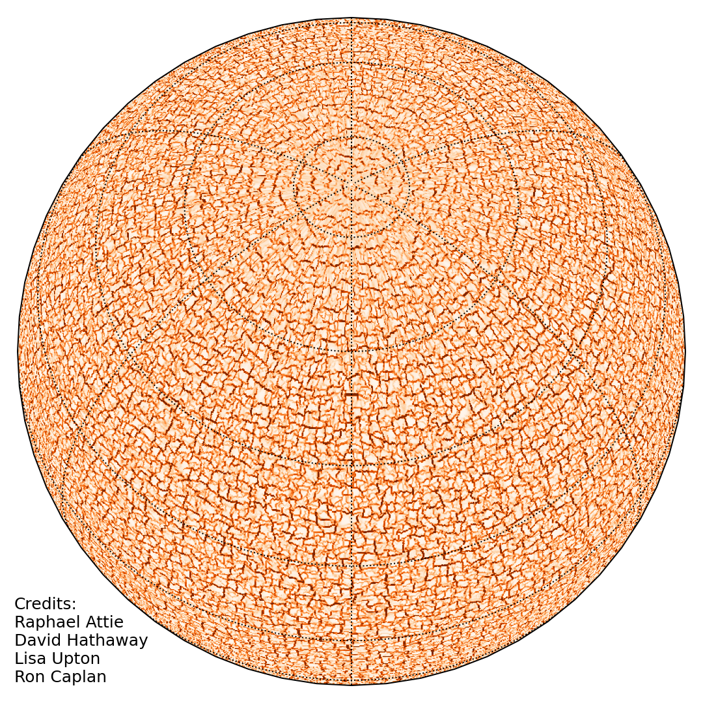

  
# ConFlow: Convective Flow Generator 
  
[Predictive Science Inc.](https://www.predsci.com)  

--------------------------------  

## OVERVIEW ##
  
ConFlow computes a sequence of velocity maps for supergranule flows on the surface of the Sun.  Such photospheric velocity fields are essential for developing and testing realistic flux transport models and the analysis techniques for observational data.  

Conflow generates these maps analytically by specifying the convection spectrum of poloidal and toroidal modes (e.g., [Hathaway (1988)](https://doi.org/10.1007/BF00147251), [Hathaway et al. (2010)](https://doi.org/10.1088/0004-637X/725/1/1082)), and advecting them with the Sun’s axisymmetric differential rotation and meridional flows.

Conflow creates the velocity maps on a spherical surface grid of phi (longitude) and theta (colatitude). It can output the maps on a [staggered grid](https://github.com/predsci/ConFlow/blob/main/doc/psi_hipft_grid.png) in [HDF5](https://www.hdfgroup.org/solutions/hdf5) format or on an unstaggered grid in binary format. The staggered grid is designed to be directly used in  [OFT](https://github.com/predsci/oft)'s surface flux transport code [HipFT](https://github.com/predsci/hipft).  When using the maps with HipFT, one should set HipFT's meridional and differential flow coefficients to those used in the ConFlow computation.  

--------------------------------  
   
## HOW TO BUILD CONFLOW
  
The included `build.sh` script will take a configuration file and generate a Makefile and build the code.  
The folder `conf` contains example configuration files for various compilers and systems.  
We recommend copying the configuration file closest to your setup and then modifying it to confomr to your compiler and system (such as `HDF5` library paths/flags, compiler flags, etc.).  
  
Given a configure script `conf/my_custom_build.conf`, the build script is invoked as:  
```
> ./build.sh ./conf/my_custom_build.conf
```

--------------------------------  

## HOW TO RUN CONFLOW
  
### Setting Input Options  
  
`ConFlow` uses a namelist in an input text file.  
The name for the input text file must be set to `conflow.dat`  
  
A full working input file with all the default parameter options is provided in the file:  
  
`doc/conflow.dat.documentation`  
   
A detailed description of each parameter is also given in that file, and (in addition to this README) is the current main documentation of the code.  
  
We have also provided example input file for a use case in the `examples/` folder.  

### Launching the Code ###
    
To run `ConFlow`, set the desired run parameters into a file called  `conflow.dat`, then copy or link the `conflow` executable into the same directory as the input file and run the command:  
  
`./conflow`  
  

### Solution Output ###
  
The output of ConFlow (using a staggered grid) are HDF5 `vt` and `vp` velocity component map files in longitude-colatitude coordinates.  
A CSV file called `flow_output_list.csv` is generated that lists the output files with the time of output.  

--------------------------------


